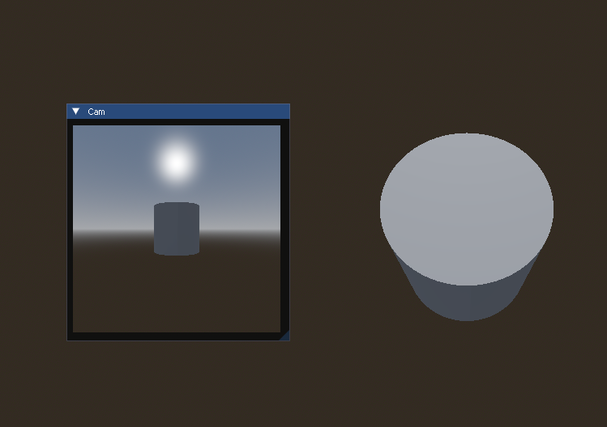
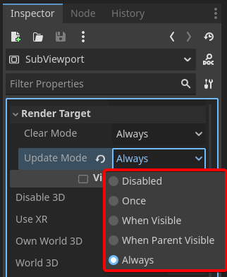
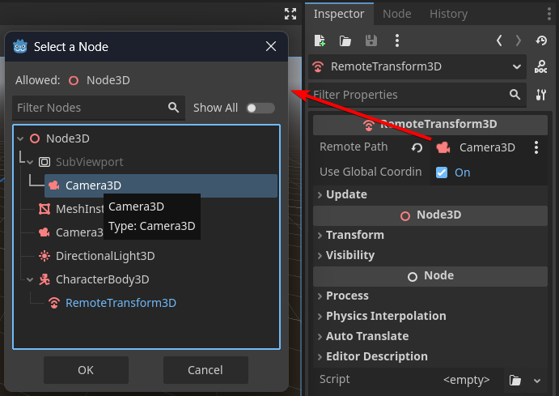

[Dear ImGui for Godot plugin](https://godotengine.org/asset-library/asset/2985)



This code lets you create a Node that draws an ImGui frame containing currently visible SubViewport frame:

```gdscript
extends Node

@export var viewport : SubViewport

func _process(_delta: float) -> void:
	Cam()

func Cam() -> void:
	ImGui.Begin("Cam")
	ImGuiGD.SubViewport(viewport)
	ImGui.End()
```

All you need to do is add a SubViewport with a camera child to your scene, link that SubViewport to this Node's export in editor and then in SubViewport properties set `Render Target -> Update Mode` to `Always`.



## Moving camera around

One issue when dealing with SubViewports is that they are of class `Node`, meaning when you add your camera that is either `Camera3D` or `Camera2D` it exists in its own transform hierarchy. It won't move with the rest of world, so you'll have a hard time interacting with global_transform to attach it to some object properly.

Godot has a nice node just for that - `RemoteTransform3D` (or 2D). Add this node as a child to your moving object and in properties select another object you'd like to attach to it.



> Depending on use case, your RemoteTransform3D probably shouldn't manipulate camera itself but rather a pivot node that holds that camera within SubViewport.

> You can also disable **Update** of separate transform properties like **Rotation** to provide your own logic or just have a fixed top-down view at all times.